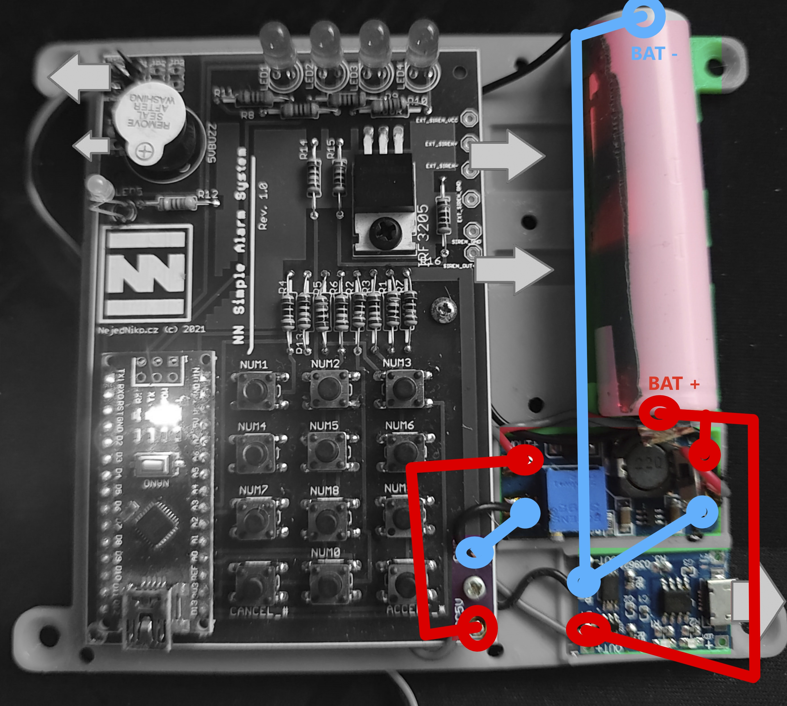

# 🛠️ OpenAlarm Build Manual
## last-updated: 23.07.2025

Made by **NejedNiko.cz**  
(c) 2021–2025 — All rights reserved  
Licensed for non-commercial personal use

This manual guides you through building the OpenAlarm hardware step by step — from preparing the parts to uploading the software and testing everything. For best results, read the entire guide once before starting.

---

## A — The Hardware

### 1. Prepare everything you need

- Soldering iron + solder
- Printed case (3D print or CNC cut, see `/dimensions`)
- Ordered or self-etched PCB (I recommend [JLCPCB](https://jlcpcb.com))
- All parts listed in [docs/BOM.md](./BOM.md)
- Arduino Nano, step-up converter, Li-ion battery, charger module, LEDs, buzzer, resistors, etc.

> Tip: Check [docs/BOM.md](./BOM.md) for links and part numbers.

---

### 2. Soldering components

- Start with **small components first**, then larger ones (standard practice).
- Leave **Arduino Nano** for last.
- The board should be labeled with component positions. If not:
  - Refer to schematic diagrams and board photos
  - Check [docs/img/OA-mounting_detail.jpg](./img/OA-mounting_detail.jpg)

#### Tips:
- **LEDs**: Do not solder flush. Leave long legs. Only shorten them if the case doesn’t close cleanly.
- **LED leveling**: Use a piece of cardboard to keep them level and consistent.

---

### 2.a. Prepare the step-up module

- **Before soldering**: Set the step-up module to output **5V**.
- Power it with a Li-ion battery or a power supply.
- Measure the output voltage with a multimeter.
- Adjust the small screw until output is 5V (±0.05V).
- Once set, the module is ready to be used.

---

### 3. Wire modules

- After soldering, connect all modules with wires as per the connection diagram.
- Double-check with a **multimeter**:
  - Continuity between connections
  - Correct voltages before plugging in the battery

> Optional: If available, use a lab power supply to power the board and test functionality before inserting the battery.

🖼️ **Visual wiring reference**:  


---

### 4. Connect the Li-ion battery

**⚠️ CAUTION: Li-ion batteries are dangerous if mishandled.**

- Use **spot welding** and **nickel strips**.
- **Never solder directly** onto the battery. This is a safety risk.
- If you choose to do so, you do it **at your own risk**.

> Personal note: I once soldered directly to a Li-ion cell. It didn’t explode, but it could have.

---

### 4.a. Sensor pins

- Solder wires or pin headers to the sensor input section (top left of the board).
- This helps later when attaching motion sensors or switches.

---

### 5. First power-on test

- Connect USB power or a charger to the charging module.
- Battery should start charging.
- Step-up module should power the main board.
- Arduino Nano should blink (default sketch is pre-uploaded).
- **Nothing should heat up.**

---

### 5.a. Fix into case

- Secure the modules using:
  - Double-sided tape or glue
  - Screws through mounting holes

---

### ✅ 6. Hardware finished!

If all steps went well, your OpenAlarm hardware is now built and ready for firmware upload.

---

## B — The Software

### 1. Prepare your system

- Use a PC/laptop that supports Arduino IDE
- Download IDE from [arduino.cc/en/software](https://www.arduino.cc/en/software)

---

### 2. Install & setup

- Install required **drivers** and **board support** for Arduino Nano
- If the Nano isn't detected, install missing packages via the Boards Manager

---

### 3. Open and configure the code

- Open the project:  
  [`code/NNOpenAlarm/NNOpenAlarm.ino`](../code/NNOpenAlarm/NNOpenAlarm.ino)

#### 3.a. Edit configuration

At the top of the code in a section properly commented:

```cpp
//Your PASSWORD HERE: (example: 9856)
const int n1 = 9; //first  digit
const int n2 = 8; //second digit
const int n3 = 5; //third  digit
const int n4 = 6; //fourth digit

int delay_time_ms_enter = 8000; //the delay for a person to enter the room and enter the code safely
int delay_time_ms_leave = 8000; //the delay for a person to leave before the alarm starts
bool beep_during_entry_sequence = true; //if the buzzer should beep while counting down the entry
```

Save your changes.

---

### 3.b. Upload a test sketch (optional but recommended)

- Upload the standard **Blink** example.
- If the LED blinks — your setup is working.

---

### 3.c. Upload OpenAlarm firmware

- Upload the modified `NNOpenAlarm.ino` sketch.
- Check the serial monitor for status output if needed.

---

### ✅ 4. Firmware ready!

- Disconnect and reconnect power.
- Press **OK** to arm the alarm (tip: unplug the siren while testing).
- It should beep.
- Press **Cancel** to disarm.

---

### 5. Final assembly

- Secure all parts inside with double-sided tape (or glue) and screws.
- Close the enclosure.
- Make sure nothing rattles.

---

### 6. Ready to use

Your hardware and software are now fully assembled and working.  
Continue to [Usage Manual](./Manual-Usage.md) to learn how to operate OpenAlarm.

